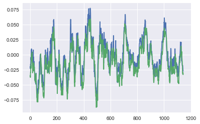

# bulbea
> *"Deep Learning based Python Library for Stock Market Prediction and Modelling [Modified for Forex Trading]."*


### Table of Contents
* [Installation](#installation)
* [Usage](#usage)
* [Dependencies](#dependencies)
* [License](#license)

### Installation
Clone the git repository:
```console
$ git clone https://github.com/achillesrasquinha/bulbea.git && cd bulbea
```

Install necessary dependencies
```console
$ pip install -r requirements.txt
```

Go ahead and install as follows:
```console
$ python setup.py install
```

You may have to install TensorFlow:
```console
$ pip install tensorflow     # CPU
$ pip install tensorflow-gpu # GPU - Requires CUDA, CuDNN
```

### Usage
#### 1. Prediction
##### a. Loading
Create a share object.
```python
>>> import bulbea as bb
>>> share = bb.Share(source='AUD', ticker='USD', start='2008-06-01',end='2018-06-30')
>>> share.data.head()
#	Open	Close	High	Low	Adj. Open	Adj. Close	Adj. High	Adj. Low	Volume
#date									
#2008-06-02 21:00:00	0.95567	0.95507	0.95662	0.95012	0.95597	0.95542	0.95687	0.95037	25579
#2008-06-03 21:00:00	0.95507	0.95230	0.96117	0.95072	0.95542	0.95265	0.96137	0.95097	29560
#2008-06-04 21:00:00	0.95230	0.95725	0.96282	0.94856	0.95265	0.95770	0.96301	0.94885	32409
#2008-06-05 21:00:00	0.95725	0.95876	0.95914	0.95102	0.95770	0.95885	0.95945	0.95127	29836
#2008-06-06 21:00:00	0.95876	0.96243	0.96401	0.95642	0.95885	0.96277	0.96446	0.95667	23165
...
```
##### b. Preprocessing
Split your data set into training and testing sets.
```python
>>> from bulbea.learn.evaluation import split
>>> Xtrain, Xtest, ytrain, ytest = split(share, 'Close', normalize = True)
```

##### c. Modelling
```python
>>> import numpy as np
>>> Xtrain = np.reshape(Xtrain, (Xtrain.shape[0], Xtrain.shape[1], 1))
>>> Xtest  = np.reshape( Xtest, ( Xtest.shape[0],  Xtest.shape[1], 1))

>>> from bulbea.learn.models import RNN
>>> rnn = RNN([1, 100, 100, 1]) # number of neurons in each layer
>>> rnn.fit(Xtrain, ytrain)
#Epoch 1/1
#1717/1717 [==============================] - 3s 2ms/step - loss: 6.5797e-04
...
```

##### d. Testing
```python
>>> from sklearn.metrics import mean_squared_error
>>> p = rnn.predict(Xtest)
>>> mean_squared_error(ytest, p)
0.00042927869370525931
>>> import matplotlib.pyplot as pplt
>>> pplt.plot(ytest)
>>> pplt.plot(p)
>>> pplt.show()
```


### Dependencies
1. fxcm
2. keras
3. tweepy
4. textblob

### License
This code has been released under the [Apache 2.0 License](LICENSE).
# bulbea-forex
